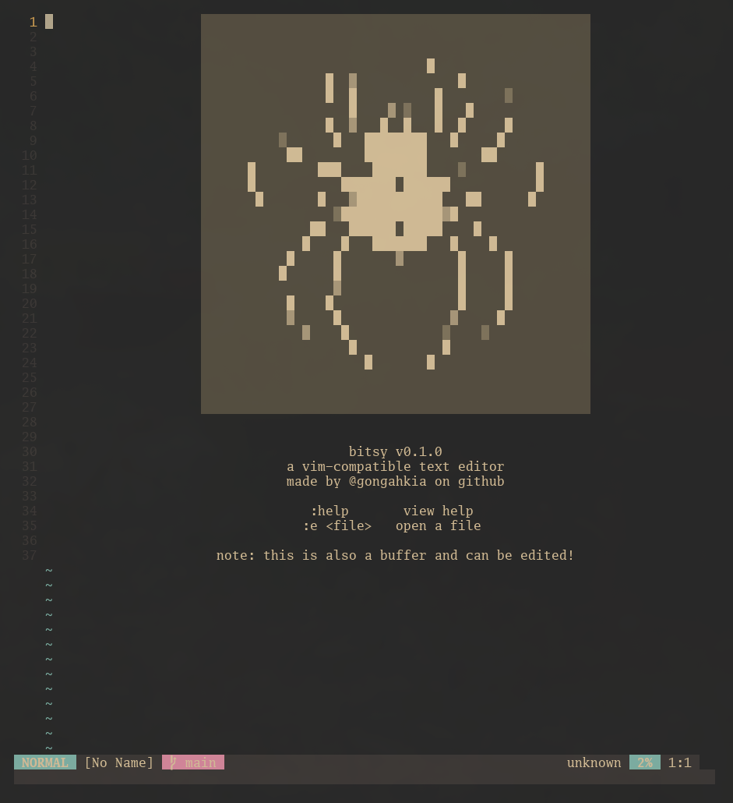
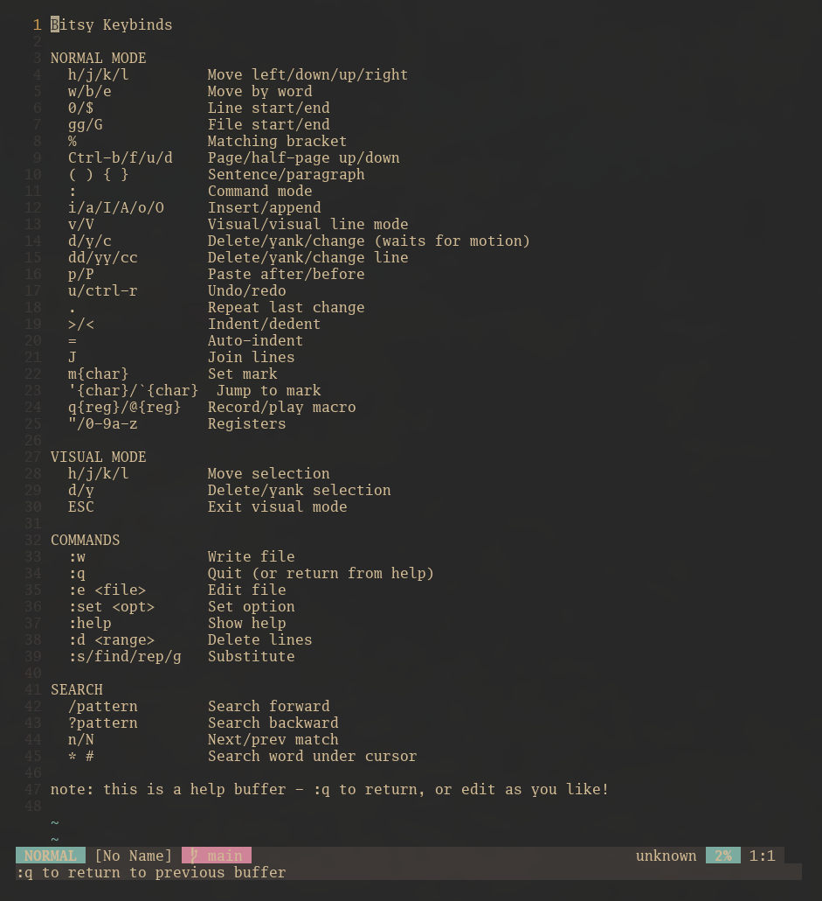
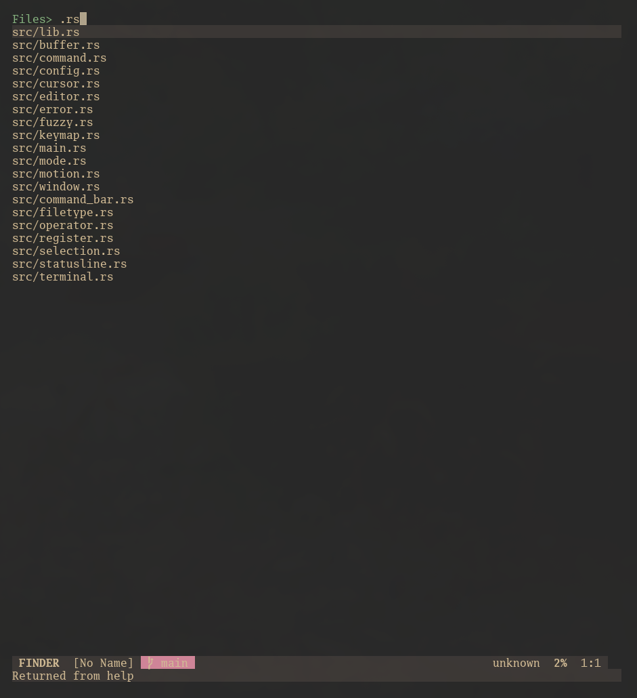

[](https://github.com/gongahkia/bitsy/releases/tag/1.0.0)

# `Bitsy`

[Vim](https://www.vim.org/)-compatible text editor written in Rust.

<div align="center">
    "
</div>

## Stack

* *Script*: [Rust](), 
* *CLI*: 
* *Parser*: 

## Video

As per custom, here is a video of `Bitsy` editing its own [source code](./src/).

<video src="./asset/reference/bitsy.mp4" controls></video>

## Other screenshots

<div align="center">
    "
    "
</div>

## Usage

The below instructions are for locally building `Bitsy`.

1. First run the below commands.

```console
$ git clone https://github.com/gongahkia/bitsy && cd bitsy
$ cargo build --release # build bitsy for production
$ cargo install --path # install bitsy locally
```

2. Then get started with `Bisty` with the following

```console
$ bitsy # open landing page
$ bitsy myfile.txt # edit an existing file
```

3. `Bitsy` additionally provides the below commands.

* `:help` in Command Mode: *Pulls up a user manual in the current buffer*
* `Ctrl + p`: *Fuzzy Finder that searches within the current directory*

## Architecture

```mermaid
...
```

## Reference

The name `Bitsy` is in reference to the nursery rhyme.

## Other notes

`Bitsy` is also the spiritual successor of [`Shed`](https://github.com/gongahkia/shed), a *much-worse* text editor I wrote at the beginning of my programming journey.