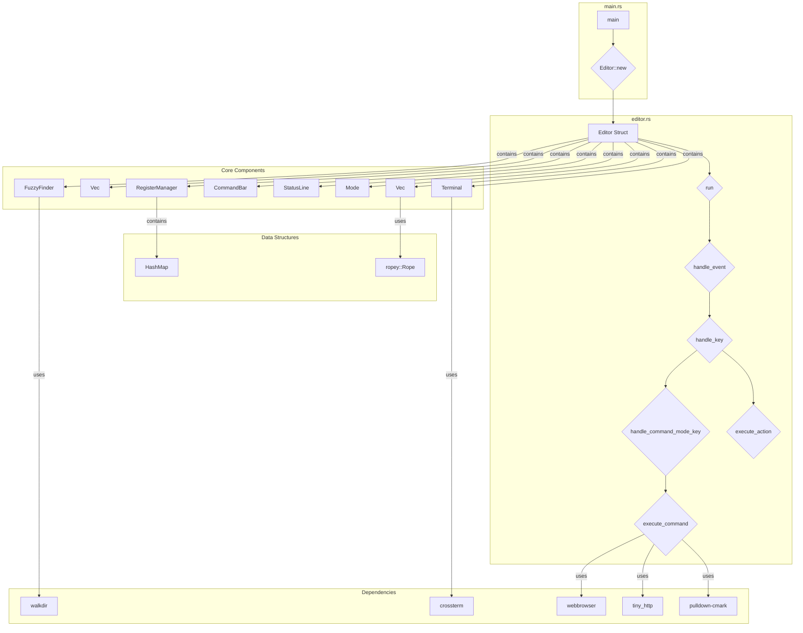

[](https://github.com/gongahkia/bitsy/releases/tag/1.0.0)

# `Bitsy`

[Vim](https://www.vim.org/)-compatible text editor written in Rust.

<div align="center">
    "
</div>

## Stack

* *Script*: [Rust](https://www.rust-lang.org/)
* *CLI rendering*: [crossterm](https://github.com/crossterm-rs/crossterm), [ropey](https://github.com/cessen/ropey), [notify](https://github.com/notify-rs/notify)
* *Errors*: [anyhow](https://github.com/dtolnay/anyhow), [log](https://github.com/rust-lang/log), [env_logger](https://github.com/env-logger-rs/env_logger)
* *Serialization and Deserialization*: [serde](https://github.com/serde-rs/serde), [toml](https://github.com/toml-rs/toml)
* *Encoding*: [encoding_rs](https://github.com/hsivonen/encoding_rs), [chardetng](https://github.com/hsivonen/chardetng)
* *Search*: [regex](https://github.com/rust-lang/regex), [walkdir](https://github.com/BurntSushi/walkdir)
* *Clipboard*: [arboard](https://github.com/1Password/arboard)

## Video

As per custom, here is a video of `Bitsy` editing its own [source code](./src/).

https://github.com/user-attachments/assets/a1a374d2-8965-4a50-bc84-6001d7682468

## Other screenshots

<div align="center">
    "
    "
</div>

## Usage

The below instructions are for locally building `Bitsy`.

1. First run the below commands.

```console
$ git clone https://github.com/gongahkia/bitsy && cd bitsy
$ cargo build --release # build bitsy for production
$ cargo install --path # install bitsy locally
```

2. Then get started with `Bisty` with the following

```console
$ bitsy # open landing page
$ bitsy myfile.txt # edit an existing file
```

3. `Bitsy` additionally provides the below commands.

* `:help` in Command Mode: *Pulls up a user manual in the current buffer*
* `Ctrl + p`: *Fuzzy Finder that searches within the current directory*

## Architecture



## Other notes

`Bitsy` is also the spiritual successor of [`Shed`](https://github.com/gongahkia/shed), a *much-worse* text editor I wrote at the beginning of my programming journey.
