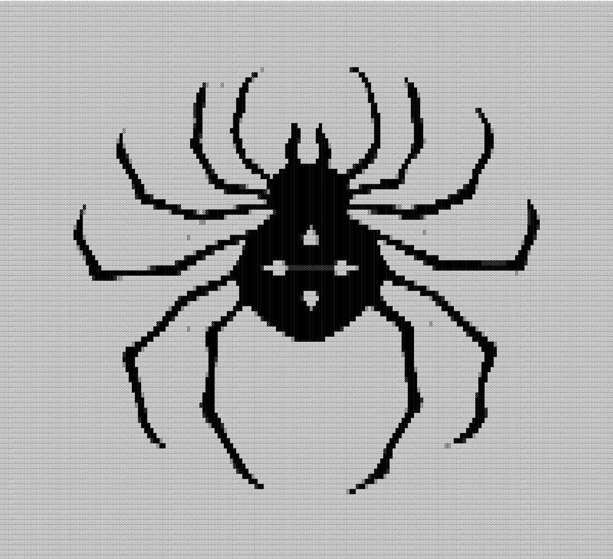

[](https://github.com/gongahkia/bitsy/releases/tag/1.0.0)

# `Bitsy`

A Vim-compatible text editor written in Rust.

<div align="center">
    
</div>

## Stack

...

## Screenshots

...

## Usage

The below instructions are for locally building `Bitsy`.

1. First run the below commands.

```console
$ git clone https://github.com/gongahkia/bitsy && cd bitsy
$ cargo build --release # build bitsy for production
$ cargo install --path # install bitsy locally
```

2. Then get started with `Bisty` with the following

```console
$ bitsy # open landing page
$ bitsy myfile.txt # edit an existing file
```

## Architecture

...
